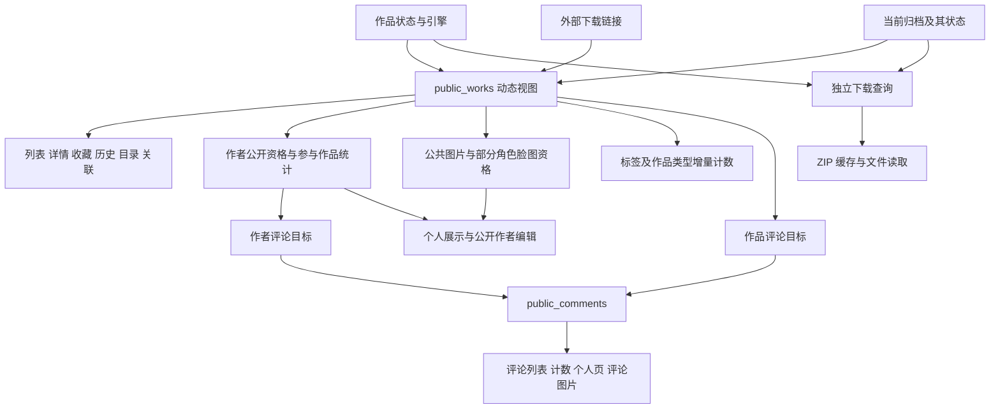

# 作品公开性依赖与减负分析

初次审计日期：2026-09-29，基线 `5f63573f`。下文保留初次审计时的依赖结构和候选分析，**不代表改造后的当前实现**。用户随后批准 A–D 批次，现已完成代码、`0010` 增量迁移及固定种子同步；未部署。实际改动和重测百分比以[优化核算报告](work-publicity-cost-report.md)为准。E 批次的额外缓存没有测量依据，本次不引入。

后续量化结果见 [优化核算报告](work-publicity-cost-report.md)。其中已撤回展示栏按类型分组能减少查询的建议；以下同步更正。本文其余“未测量”说明描述的是初次静态审计范围。

## 1. 结论与范围

作品显隐确实形成了跨模块依赖，但成本最大的规则不是单独的 `status='published'`，而是把作品资料、下载来源、作者身份、媒体资格、评论目标和统计口径绑定成同一个“公开”概念。

建议优先顺序：

1. 消除不改变业务语义的重复读取和不需要的统计投影。
2. 已公开的封面、头像等静态图片，与作品当前公开性解除绑定；保留从未公开内容和图片自身撤下的边界。
3. 作者资料、作者评论、作者头像、角色脸图的公开资格独立于作品的当前下载状态。
4. 单独决定“失去下载来源是否必须让作品资料也消失”。如果允许资料留存，才有条件大幅简化 `public_works` 及统计触发器。
5. 保留真正负责作品内容访问、内容审核、用户隐私、写入权限和下载版本有效性的检查。

范围包含作品公开性的直接 SQL、派生视图/统计、辅助函数、页面/API 调用链、旁路状态判断、发布与维护入口、缓存与本地安装边界。论坛、工具发布、用户隐私等独立公开规则另列边界，不把它们误算为作品显隐成本。

本次通过包含隐藏目录的代码搜索和调用点阅读核对。`app/.server` 中直接引用 `public_works` 的文件有 13 个；该数字不包含间接引用和手写状态条件，不代表查询次数。没有读取线上数据库、运行浏览器、增加测试、执行性能基准或修改业务代码。下面的成本判断来自代码结构；没有线上耗时、D1 扫描行数、请求量或账单证据，不能宣称某个优化可节省确定百分比。

## 2. 当前依赖结构

`public_works` 是普通 SQL 视图，每次使用由数据库执行其中的条件，不是预先保存的一张公开 ID 表。实际是否复用子查询、是否扫描全部候选，要由查询计划决定；不能只看到 `IN` 或 `EXISTS` 就断言快慢。

基线定义见 [0001](../migrations/0001_init_archive_schema.sql)，1702–1722 行：

- 作品必须 `published`。
- 2000/2003 系要求唯一的已发布、current、未清理归档，且没有下载页链接。
- 其他引擎要求没有已发布 current 归档，且恰好一个下载页链接。
- `public_comments` 同时检查评论、主楼、双方账户状态，以及作品/作者/角色目标资格；作者资格又追溯到公开作品。

已有成本控制应保留：归档按作品/状态/current 的索引、下载链接按作品/类型的索引、署名反向索引，以及标签/类型的增量计数。它们不代表所有查询已经最优，也不应因简化公开规则而一并删除。

## 3. 完整业务依赖清单

“保留”表示边界必要，但其 SQL 可以优化；“解耦”表示需要先采纳对应产品语义；“合并”表示有不改变可见范围的优化候选。下表按业务职责列举，同一文件可能承载多项。

| 编号 | 部分与代码入口 | 当前依赖与发生时机 | 建议与可减少的负载 |
| --- | --- | --- | --- |
| 01 | 作品列表、搜索、总数：`db/game-library.ts`，`buildWhere`、`gameWorksListStatement`、`gameWorksCountStatement` | 每次列表/计数过滤 `public_works`，过滤早于分页；首页/全站搜索/筛选页间接使用 | 保留作品可见边界。先限定候选再判断；不能先分页再过滤。若采纳第 6 节，下载来源子查询可退出这些路径 |
| 02 | 指定 ID 卡片与作品详情：同文件 `getPublicGameWorkSummaries`、`getGameWorkDetail` | 已按 ID 或候选 ID 关联检查；详情还加载归档和关系 | 保留外部入口检查；同请求内部可复用已取到的作品，不增加跨请求授权缓存 |
| 03 | 收藏/游玩历史页：`searchUserWorks` | 本人与公开个人页均只展示当前公开作品；总数和列表都过滤 | 公开个人页保留。本人页可考虑失效占位，但不可直接读回隐藏作品当前标题、图片等元数据；此改动主要改善体验，不保证减负 |
| 04 | 失效收藏：`db/user-work-tags.ts:listUnavailableFavorites` | `NOT EXISTS public_works`，只返回本人已有的作品 ID，供移除 | 保留现有最小披露边界，不为少查一次而返回隐藏作品信息 |
| 05 | 目录成员、成员数、默认封面：`db/catalogs.ts:loadCatalogDetail`、`CATALOG_SUMMARY_SELECT` | 同一目录分别过滤成员、计算公开成员数、寻找首个公开成员封面 | 保留成员过滤；合并相同候选集或按页面目录 ID 批量计算。默认封面选择仍应来自可展示成员；这与图片 URL 是否可继续读取是两回事 |
| 06 | 目录添加作品：`addCatalogItem`；目录共用搜索 `api/works/lookup` | 新增时目标必须公开，搜索只暴露公开作品 | 保留写入边界；移除已有成员不必重新要求目标公开，不能强迫用户保留失效引用 |
| 07 | 普通关联与翻译关联展示：`game-library.ts:loadWorkCollections`、`listTranslations` | 过滤另一端作品，隐藏目标的标题和备注不进入公开卡片 | 保留；候选关系 ID 范围内查询。页面源作品通过不代表另一端也通过 |
| 08 | 关联搜索、新建、改类型、编辑能力：`db/relations.ts` | 两端公开性、上传者资格及能力判断可能分别查库 | 可以合并作品状态/归属读取，但外部写入必须保留最终权限与有效性条件；删除旧关联应允许清理失效目标 |
| 09 | 作者索引资格、详情资格：`db/creator-library.ts:publicCreatorFilter`、`getPublicCreatorDetail` | 作者至少署名一部公开作品，否则作者身份在这些入口也不可见 | 解耦。作者独立公开后，身份查询不必访问作品/归档/链接；首次公开与从未公开作者的处理见第 5 节 |
| 10 | 作者公开作品数、最近关联日期、作品列表：同文件 `summarySql`、作品分页 | 公开作品数和 MAX 日期各自经过作品筛选；排序/分页也依赖这些值 | 作品列表/公开作品数仍保留过滤。列表不消费的最近日期投影可以不计算；按作品数排序不能先分页后计数 |
| 11 | 作者公开资料/头像编辑：`db/creator-edit.ts`、`api/creators/[creatorId]/avatar` | 初读、写入审计门槛以及头像入口依赖作者公开作品；写入另有权限、并发快照和审计保护 | 作者独立公开后替换作品链条件；保留权限、快照比较和事务内写入门槛，不能只靠前置页面检查 |
| 12 | 角色详情和相关作品数：`db/character-detail.ts`、`db/taxonomy-library.ts` | 角色身份已经独立公开；相关作品、作品数仍依赖 `public_works` | 保留作品列表/计数口径；无需给角色身份新增显隐依赖 |
| 13 | 角色默认脸图：`db/character-portrait-library.ts:PUBLIC_CHARACTER_PORTRAIT_CONDITION` | 活跃图像，且素材批准或被公开作品使用。查询字符资料时连带查作品 | 解耦已明确公开的脸图；用素材自身资格替代作品实时关系。不能简单改成只接受 approved 而让目前合法使用的图片全部消失 |
| 14 | 角色选择器、分类浏览头像：`db/character-picker.ts`、`taxonomy-library.ts` | 复用上述脸图条件；选择器可另要求 approved 素材 | 跟随 13 一起处理；素材批准、图片有效性及选择器用途限制不能混同 |
| 15 | 个人展示的作品/作者目标：`db/showcase.ts:sources`、`findShowcaseTargets`、读取展示内容 | 作品要求公开，作者要求公开署名；最多三项，每种类型最多一项，分别查目标 | 作品保留；作者可解耦。按 kind 分组不能减少查询，撤回该优化建议；保留顺序、附言及失效占位 |
| 16 | 展示栏脸图选择、读取与保存：`db/showcase-portraits.ts`、`showcase.ts` | 选择器、可用性、插入及保存子查询复用脸图规则；事务内可用性可使非法保存失败 | 跟随 13 解耦作品依赖；保留角色归属、格坐标、素材状态及事务内约束 |
| 17 | 公共封面/预览/头像/目录封面/素材读取：`api/media/blobs/[sha256]` | 一次 D1 查询经多个 OR 分支寻找可公开引用，作品/作者/部分脸图分支追查公开作品；成功后一次 R2 GET | 优先解耦，见第 5 节。简化引用条件只减少 SQL 工作，仍有 D1 查询；不能将它称为零数据库图片服务 |
| 18 | 隐藏作品编辑图片：`api/works/[workId]/media/[sha256]` | 私有读取/本人维护权限、图片属于作品、blob 活跃；`private, no-store` | 保留。不能把公共图像接口放宽到任意 blob 来绕开这里 |
| 19 | 短评论目标：`db/work-community.ts:publicTargetStatement`、`publicCommentTargetSql` | 作品目标查公开作品，作者目标查公开署名，角色目标仅查角色存在 | 作品保留；作者解耦。目标验证可与同请求读取合并，但评论 API 自身仍有完整边界 |
| 20 | 评论列表、主楼、回复、定位、点赞/置顶：同文件 `listRootComments`、`listReplies`、`requiredComment` 等 | `public_comments` 混合内容、账户、主楼、目标资格；部分路径先检查目标再读该视图 | 可按单一目标合并或复用验证；混合目标查询仍需逐目标约束。不能取消评论/主楼审核与账户条件 |
| 21 | 作品社区统计、收藏者页：`getWorkCommunitySummary`、`listWorkCollections` | 外层检查作品；评论总数又经 `public_comments`；收藏者有独立用户隐私条件 | 同一语句内以已满足的目标条件计算局部评论统计是候选；保留评论审核、用户隐私、公开计数一致性 |
| 22 | 本人及公开个人页评论：`searchUserComments`；角色评论计数 `db/character-index.ts` | 本人也检查目标可见；公开模式同时检查目标 SQL 和 `public_comments`；评论摘要还复用角色脸图条件 | 公开模式中重复的目标条件可候选合并；COUNT 的非过滤装饰 JOIN 可评估移除。本人模式仍须有目标边界，不能全局删掉该条件 |
| 23 | 评论图片上传、读取：`comments/images.ts` | 上传检查目标；读取通过 `public_comments` 判断公开，否则检查管理者/本人未绑定图片；响应 `no-store` | 与静态封面不同，保留内容审核边界；作者目标解耦后自动少走作品链；不要让隐藏评论图片永久公开 |
| 24 | 收藏、新标签/附言、游玩记录写入：`setWorkFavorite`、`recordWorkPlayed` | 写入 SELECT、标签更新与清理 SQL 中嵌入公开条件；取消收藏已不要求公开 | 保留新增操作边界。已有私人备注/标签能否独立维护可另定语义；不可直接删除 batch 内保护，让首语句失败后后续语句仍改数据 |
| 25 | 本人常用标签：`listUserTags`；收藏对话框 `getWorkFavorite` | 按本人标签聚合，但每条仍限制作品公开；同一函数也服务公开收藏页筛选 | 可以只对本人编辑候补取消作品公开过滤；公开页保留，避免把私人词条带到公开接口。取消过滤会增加候选数量，需实测净收益 |
| 26 | 公共标签、匿名用户标签统计与搜索：`public_user_work_tags`、`counted_public_tags`、`counted_user_tags`、`tag_usage_stats` | 当前公开作品贡献计数，账户状态也参与；读取推荐直接走统计表 | 维持增量设计，不能退回每次读取全量聚合。若资料/下载分离，可减少归档/链接导致的同步；是否保留零使用标签是另一个语义选择 |
| 27 | 作品类型候补/管理计数：`db/work-genres.ts`、`counted_work_genres` | 候补只读 `public_count>0`，作品类型/状态/引擎/归档/下载链接变化同步受影响作品 | 当前读路径已经便宜，不优先删除统计体系；资料/下载分离后可以缩小触发器依赖 |
| 28 | 热门脸图表情：`emojis/service.ts:hotEmojis` | 最近 30 天评论使用聚合，手写作品 `published` 与作者署名条件，未使用完整 `public_works` | 必须单列，见第 7 节；先确定统计语义，再决定仅独立作者/内容状态或一致公开目标。不得把这条旁路漏出审计 |
| 29 | 原生 ZIP 下载、Kai 导入信息：`worker/archive-download.mjs:getDownloadRecord` | 版本 published/current，作品 published；读取发生在 ZIP Cache API 查询之前 | 保留下载有效性边界；单独去掉状态谓词不消除读取，因为同查询还提供 manifest、文件名等信息 |
| 30 | 在线游玩页面、安装元数据：`db/archive-downloads.ts`、`api/archive-versions/[archiveVersionId]/web-play`、`play/[workId]/page.tsx` | 安装元数据读取版本；页面另外读完整作品、社区统计、评论；安装总量另查一次版本 | 元数据与总量可合并；页面可缩小投影/复用作品结果；不能把页面曾通过当作后续下载请求的授权 |
| 31 | 上传提交、作品修改、归档维护：`archive-commit.ts`、`game-library.ts`、`work-distribution.ts`、`archive-maintenance.ts` | 发布时校验来源；现有缺源作品可维护；切换/删除 current 改变公开视图结果并触发统计 | 发布/归属/数据完整性保留。是否允许已发布资料在缺源时留存另议，不能只改读取视图而忽略编辑/恢复语义 |

以上目录成员、个人展示、作品关系里的备注也属于数据输出；即使放开图片原始 URL，仍不代表可以把隐藏目标的标题和备注重新输出。

## 4. 无需改变公开范围的优化候选

### 4.1 展示栏批量读取建议已撤回

`showcase.ts` 读取条目后，在循环中 `await findShowcaseTargets`。但 `parseShowcaseInput` 明确限制最多三项，而且每种类型只能一项。

因此按类型分组仍是原来的 1–3 次目标查询，查询数收益为 **0%**。初次分析遗漏了该限制，不应将此项列入优先优化。合并成一次 batch 的传输收益属于另一种方案，本次没有实测，也不计收益。

### 4.2 页面内的重复目标验证

作品详情当前依次经历：`getGameWorkDetail` → 侧栏社区统计 → 评论目标验证及 `public_comments` → 登录用户关系编辑能力。游玩页面在此之前还有版本读取。它们在同一响应中多次判断同一作品。

优先合并 SQL 或传递服务端已读取的最小作品上下文。不要新增可由客户端控制的 `skipVisibility`；不要把请求内复用扩展成长期授权缓存。若仍是多个数据库语句，不能声称拥有相同快照；需要明确并发隐藏时的一致性要求。独立评论/下载 API 仍须自行校验。

这主要减少重复目标读取；评论审核、另一端关联资格、当前用户权限仍是不同检查，不可一起省略。

### 4.3 删除不需要的投影与装饰查询

- `browsePublicCreators` 使用共享 `summarySql` 计算 `latest_work_credit_at`，但返回的轻量列表 DTO 不包含该字段；作品数仍需保留。详情/其他列表使用最近日期，不可全局删除。
- `searchUserComments` 的 COUNT 复用带角色头像 LEFT JOIN 的整段 FROM。若确认约束保证 JOIN 不改变行数，可拆出计数查询；具体能省多少由查询计划决定，优化器可能已消除一部分。
- 公开个人评论模式已经使用 `public_comments`，其中有目标检查；额外的 `publicCommentTargetSql` 存在逻辑重叠。只对该分支合并，非公开模式不能跟着删。
- 安装元数据查询已经读取 archive version；可同时取安装文件数和大小，取消 `getWebPlayInstallTargetTotals` 的额外往返。确认所有调用者，避免为此加载完整作品详情。
- 目录成员数与默认封面选择、作者公开作品数与最近日期，可评估对限定 ID 的共同聚合。按聚合值排序时，不能在取页之后补算来改变排序含义。

这些属于候选，不宣称未经 EXPLAIN 和测量就一定更快。特别是 `IN` 改 `EXISTS`、CTE、JOIN 重排均应以计划为准。

## 5. 图片与独立资料的解耦方案

### 5.1 推荐的媒体语义

区分三个事实：是否已经明确公开过、图片自身是否被撤下、当前页面是否还展示它。作品隐藏只改变第三项；图片下架由图片自身处理。从未公开的图片仍然私有。

当前 blob 表的 `active` 是存储生命周期，不是公开许可；不能用 `active` 替代公开判断。`works.published_at` 也不足以证明这张图片公开过：作品可能先公开、后隐藏、再新增一张私有图片。脸图按整张 sheet 读取，批准一个格子意味着浏览者可能获取整张图，也需纳入发布语义。

实现上优先采用一个最小、稳定的媒体公开资格来源，避免重新建立“当前所有引用的公开计数”。可评估在已验证媒体上保存首次公开资格，读取只按 hash 查询资格和自身状态。数据库与发布路径须同事务或采用失败时不放行的顺序；未完成发布不得先对外公开。不要因为 `exists` 去重上传就重置媒体资格。

对应收益必须分清：

| 方案 | D1 查询 | R2 读取 | 代价/约束 |
| --- | --- | --- | --- |
| 只把复杂引用图换成媒体自身资格 | 到达处理器仍通常 1 次 | 成功仍通常 1 次 | 主要减少扫描/关联与维护耦合，改动相对集中 |
| 在稳定公开资格基础上缓存图片响应 | 命中可避免资格查询，取决于检查顺序 | 命中可避免 R2 GET | 要说明图片独立撤下的失效时间；当前长期浏览器缓存也不能被服务端强制收回 |
| 独立公共存储或静态资源发布链 | 有机会绕过应用 D1/Worker 路径 | 取决于托管方式 | 引入发布同步、存储保留与撤回复杂度；先不作为默认方案 |

现有 `Cache-Control: public, max-age=31536000, immutable` 能让浏览器缓存，但不能据此断言 Worker 已有边缘图片 Cache API。当前媒体处理器没有显式 `caches.default.match/put`；是否还有部署层缓存规则，本次未查。安装封面还会先查本地 cover cache、缺失后 `fetch(..., cache:'no-store')`，因此不能假定所有图片流量都被普通浏览器缓存吸收。

公开资格不是永久保留文件的承诺。GC 仍应按真实引用和保留策略运行；不要因为新增“曾公开”记录就意外让所有孤立图片永不回收。需要永久 URL 的图片则应单独定义保留策略。相同 hash 在公开/私有引用间共享时，其字节已公开，但私有引用对应的作品信息仍不能公开。

### 5.2 作者资料独立公开

建议让已公开作者资料保留，作品数允许为零，作品列表继续过滤。作者详情、头像、作者评论目标、展示栏和公开编辑资格统一采用作者自身的公开边界。

“直接开放 creators 全表”只有在确认所有作者元数据本来就属于公开目录时才可用。若作者可在私有作品编辑时被创建，需要稳定的首次公开资格或明确的公开操作，避免把从未发布的人名/简介顺带公开。旧数据不能从“目前没有公开作品”推断“从未公开过”，也不能无证据批量补为公开。

解除作者身份依赖不会消除公开作品数、最近作品日期和作品分页的计算；仍应保留正确的展示口径。公开作者编辑要继续检查编辑权限、乐观并发和审计。

### 5.3 角色脸图独立资格

角色身份已经独立公开，无需重做角色模型。只替换“素材已批准或来源作品目前公开”的第二分支，使已明确公开的脸图不随来源作品退场。

不能机械地把全部 pending 素材批准，也不能只改图片 GET：角色详情、分类、选择器、展示读取和事务内保存都复用资格规则，必须一起改变。素材自身被拒绝/撤下、图片不存在、角色绑定不匹配、格坐标越界继续拒绝。

### 5.4 评论图片不是同一类静态资产

`comments/images.ts` 和论坛 `image-handler.ts` 都采用 `no-store`，非公开图片有权限回退。这些图片可能就是被审核的内容本体，不能因为“图片通常可缓存”就永久公开。

作者独立公开会自然消除作者评论图片的署名追溯；评论本身、主楼、账户和目标边界应保留。若只对图片另设稳定公开资格，必须明确接受隐藏评论后附件仍可访问；不建议把此语义混入封面优化。

## 6. 最大的结构性选择：作品资料与可下载性是否分离

目前仅删除 hidden 状态，仍有 processing/deleted 和引擎/来源条件，大量查询与触发器不会消失。

可选方案：作品 `published` 只表示资料允许浏览；下载、安装另查当前来源和版本。失去最后一个下载来源后，资料、评论、作者署名、标签和类型统计仍保留，下载入口标示暂不可用。

若采用此语义：

- `public_works` 可收敛为作品自身的发布状态，读取不再追查归档/链接。
- 保留发布时合法来源校验也可以；“首次发布必须有来源”不必等同于“以后缺源资料立即消失”。
- 标签和类型统计仍需处理作品显隐、改标签/类型、账户状态等变化，但可移除仅因引擎/归档/current/下载链接改变而进行的公开计数同步。
- 所有依赖公开作品的查询同时变轻，比只删图片条件覆盖面大。

这是产品行为变化，不能在本次分析中默认采纳。需要同步处理公开页面的空来源状态、按钮、搜索、统计、恢复与删除流程，并用有序增量迁移调整视图/触发器；不能编辑已应用的 0001，也不能重建正式库。

如果仍要求缺源作品完全退出公开浏览，则保留动态视图。只有测量证明读成本显著时，才考虑物化公开资格：它会新增写入同步入口和一致性风险，不是无成本的默认优化。

## 7. 发现的规则不一致与边界

### 7.1 热门表情使用另一套作品公开条件

`emojis/service.ts` 340 行附近的 `hotEmojis` 只检查作品 `status='published'`；完整 `public_works` 还检查来源。因此缺源作品的评论可能不在公开评论页出现，却仍贡献热门表情统计。这里只展示聚合表情，不应直接定性为评论正文泄露。

应明确热门统计到底代表“当前公开内容使用”还是“历史有效使用”。前者统一口径；后者可把作品来源与作者署名从聚合中移除，但依然保留评论审核与用户状态约束。只有接受统计允许短时滞后后，才评估缓存匿名聚合结果。表情可用性本身走 approved 素材/active blob，不依赖作品，应保持独立。

### 7.2 下载实现与架构说明不一致

`docs/game-domain-architecture.md` 194 行称已发布历史版本不要求 current；实际 `worker/archive-download.mjs` 285 行和 `db/archive-downloads.ts` 83 行均要求 `is_current=1`。下载查询也不等同于完整 `public_works`。

本报告以代码描述当前行为。这是需要单独统一的协议/产品决定，不应在优化时顺手删掉 current 或补入整个公开视图。已发布下载 URL、安装 manifest、客户端升级/回退和存档兼容要按真实协议处理。

### 7.3 缓存命中不是零服务成本

ZIP 缓存命中前已有版本/作品查询；共享播放器还要查其独立发布资格并 HEAD 对象，命中后有下载统计写入。移除作品状态谓词不消除这些必要元数据和统计工作。

完整安装后读取本地游戏资源，不等于每读一个素材文件就到 D1 检查作品。在线页面、安装元数据、ZIP 下载、封面请求和游玩记录是需要分别计量的入口。已下载文件也不能因作品隐藏而从用户设备撤回。

### 7.4 不属于作品显隐负担的系统

| 部分 | 已核对的边界 | 建议 |
| --- | --- | --- |
| 浏览量 `views/service.ts`、作品 view POST | 普通记录/读取走限流、DO 和计数缓存，没有 `public_works`；管理合并 outbox 才涉及 D1 | 不以本次减负为由修改，也不新增公开性读库 |
| 论坛公开主题/楼层/回复、搜索、通知、站点地图、论坛图片 | 使用论坛自己的状态及用户资格，未依赖作品公开视图 | 保留内容审核；不能把名称中的 public 当作作品显隐依赖 |
| 工具/资源/更新 manifest/共享播放器 | 使用 resource visibility、release status、artifact storage status | 保留发布与撤回协议；资源图标字节可纳入稳定媒体资格讨论，但不放开安装包 |
| 用户主页隐私、收藏者名单、收藏目录 | 用户自身开关/身份权限，与作品状态是不同轴 | 保留；尤其本人候补不能通过共享服务函数流到公开页面 |
| 归档上传、对象哈希/格式、归属校验、维护权限 | 负责真实性、数据完整性和私有内容操作 | 保留，不能移到仅前端检查 |
| 归档 GC、评论图片 GC | 主要检查引用、存储生命周期和删除/宽限期；隐藏作品与暂时非公开评论目标仍可能恢复 | 不用 public_works 作为可删除文件集合。稳定公开资格也不能自动成为永久 GC 保留引用 |
| 运行时静态文件、已安装的本地资源 | 与具体作品实时公开视图分离 | 保持分离；不增加在线撤回轮询 |

## 8. 实施批次与验收建议

| 批次 | 内容 | 行为变化 | 可验证的收益/完成条件 |
| --- | --- | --- | --- |
| A | 轻量作者投影、安装元数据合并、公开评论重复条件核对 | 目标是无变化 | 同输入 DTO、分页、排序、失效占位一致；按项确认 SQL 调用数或执行量下降；EXPLAIN/扫描量不恶化 |
| B | 稳定公共媒体资格；先做封面/头像/公开素材 | 隐藏作品不再撤回已公开图片 URL | 从未公开图片不开放；相同 hash/重新上传/替换/独立撤下/GC 有明确结果；媒体读路径不再追查作品分发图 |
| C | 作者独立公开、角色脸图资格独立 | 零公开作品作者和已公开脸图继续存在 | 作者页、编辑、评论、展示和媒体规则一致；从未公开对象不被意外发布 |
| D | 可选：作品资料与下载可用性分离 | 缺源作品资料仍可浏览 | 来源变化不再更新标签/类型公开计数；下载仍拒绝无效版本；页面明确处理缺源状态 |
| E | 根据测量决定局部缓存或公开资格物化 | 可能允许短暂陈旧 | 先定义失效时限，实测 D1/CPU/R2 减少，再承担同步复杂度；没有收益则不实施 |

A 批次的目标是低风险候选，仍须核对并发语义；不是将所有重复看起来相似的检查无条件删除。B–D 需要明确采用新的产品规则后才能实施。

测量应以单个用户动作和入口为单位：D1 语句数/往返数、rows_read/rows_written、数据库耗时、Worker CPU/响应耗时、R2 GET/HEAD、缓存命中率。数据分布包括公开/隐藏/处理中/缺源作品，署名多的作者，重复图片引用及较多收藏标签的用户。禁止用代码行数估算账单节省。

媒体按“每个到达 Worker 的请求”比较，不能把浏览器命中、边缘命中、Worker Cache API 命中混为一谈。触发器按普通打标、一次显隐、current 切换、来源增删分别比较；代码显示其处理受影响作品，不应误报成每次请求全站重算。

实施后按实际改动选择既有静态/契约检查。只有修改 app TSX/样式时再纳入既有 UI 静态检查；新增测试和浏览器交互须另获明确授权。本次仅形成文档，未运行这些验收，未部署或写入远端数据。

## 9. 代码定位索引

以下定位用于复查本报告基线，后续变更可能移动行号。

| 文件 | 重点定位 |
| --- | --- |
| [0001 schema](../migrations/0001_init_archive_schema.sql) | 685 归档索引；1636 表情资格；1702 public_works；1713 public_comments |
| [0006 标签统计](../migrations/0006_tags_favorites_and_read_indexes.sql) | 92 最终 public_user_work_tags；179–355 增量同步；425 下载链接索引；435 署名反向索引 |
| [0009 类型统计](../migrations/0009_work_genre_groups.sql) | 33 counted 表；48–145 作品/归档/下载链接触发器 |
| [作品库](../app/.server/db/game-library.ts) | 213 卡片；230 个人列表；393 详情；597/824 编辑；1275 摘要；1413 过滤；1700 集合；1955 翻译 |
| [目录](../app/.server/db/catalogs.ts) | 250 添加；298 详情；477 附近共享摘要 |
| [作品搜索 API](../app/.server/endpoints/api/works/lookup/route.ts) | 82 公开作品查询 |
| [作者库](../app/.server/db/creator-library.ts) | 62 轻量列表；118 公开筛选；133 详情；417 署名过滤；479 摘要 |
| [作者编辑](../app/.server/db/creator-edit.ts) | 9 公开门槛；32 初读；54 事务审计门槛 |
| [角色详情](../app/.server/db/character-detail.ts) | 35 默认脸图；76 相关作品 |
| [分类与标签](../app/.server/db/taxonomy-library.ts) | 523 标签公开计数；886 角色摘要；889 标签摘要 |
| [角色指标](../app/.server/db/character-index.ts) | 89 public_comments 聚合 |
| [脸图资格](../app/.server/db/character-portrait-library.ts) | 48 公共条件；383 选择资格 |
| [角色选择器](../app/.server/db/character-picker.ts) | 32 脸图条件 |
| [展示栏](../app/.server/db/showcase.ts) | 29–62 目标来源；131 脸图；读取条目后逐项 findShowcaseTargets |
| [展示脸图](../app/.server/db/showcase-portraits.ts) | 5 来源；26 可用性；40 注册；66 保存子查询 |
| [关系](../app/.server/db/relations.ts) | 58/119 普通关联；244 翻译；484 公开断言；496 编辑能力 |
| [作品社区](../app/.server/db/work-community.ts) | 67 游玩；86 收藏；148 摘要；181 收藏者；235 主楼；329 回复；450 个人评论；780 附近目标断言 |
| [用户标签](../app/.server/db/user-work-tags.ts) | 7 聚合推荐；33 本人标签；84 收藏编辑；122 失效收藏 |
| [类型候补](../app/.server/db/work-genres.ts) | 7 suggestWorkGenres |
| [公共媒体](../app/.server/endpoints/api/media/blobs/[sha256]/route.ts) | 30 授权查询；110 长期缓存头 |
| [私有作品媒体](../app/.server/endpoints/api/works/[workId]/media/[sha256]/route.ts) | 11 权限；16 所属作品；27 私有响应 |
| [评论图片](../app/.server/comments/images.ts) | 78 上传目标；130 读取资格 |
| [热门表情](../app/.server/emojis/service.ts) | 340 hotEmojis，手写作品/作者公开条件 |
| [下载 Worker](../worker/archive-download.mjs) | 60 D1；77 共享播放器；102 缓存；259 元数据；937 统计 |
| [游玩元数据](../app/.server/db/archive-downloads.ts) | 46 安装总量；63 公开版本记录 |
| [游玩页面](../app/play/[workId]/page.tsx) | 59–85 多次读取目标 |
| [作品页面](../app/games/[id]/page.tsx) | 32–40 详情、侧栏和评论调用链 |
| [侧栏](../app/.server/work-overview-sidebar.ts) | 16–21 社区/目录/关系/上传者读取 |
| [安装封面](../app/play/[workId]/web-play-cover.ts) | 本地 cover cache 与网络 no-store |
| [分发校验](../app/.server/db/work-distribution.ts) | assertStableDistribution |
| [归档维护](../app/.server/db/archive-maintenance.ts) | current 切换、删除与恢复 |
| [对象 GC](../app/.server/storage/gc-candidates.ts) | 27 附近引用检查，非作品公开资格 |
| [评论图片 GC](../app/.server/comments/image-cleanup.ts) | 删除/宽限期，保留隐藏内容 |
| [浏览量](../app/.server/views/service.ts) | 17 记录；28 缓存计数 |
| [共享播放器](../app/.server/resources/archive-player.ts) | 独立资源发布与存储检查 |
| [资源分发](../app/.server/resources/public.ts) | 安装包/更新 manifest 的独立公开规则 |
| [论坛图片](../app/.server/forum/image-handler.ts) | forum_public_posts 与 no-store |
